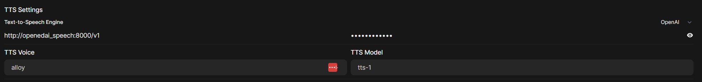
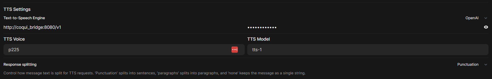

# Ollama Stack

This repository contains a Docker Compose configuration to set up a comprehensive AI stack, including large language models, text-to-speech services, and a web interface.

The base `docker-compose.yml` file defines a CPU-only configuration. Hardware-specific acceleration or platform adjustments are handled via override files.

## Services

The stack can include the following services depending on the configuration used:

- **`ollama`**: The core Ollama service for running large language models locally.
  - Port: `11434`
- **`webui`**: The Open WebUI interface for interacting with Ollama models.
  - Port: `8080`
- **`openedai_speech`**: A text-to-speech service compatible with the OpenAI API standard.
  - Port: `8000`
  - Volumes: Uses `./openedai-speech/voices` for voice data and `./openedai-speech/config` for configuration.
- **`coqui_tts`**: The Coqui TTS server for generating speech.
  - Port: `5002`
- **`coqui_bridge`**: A bridge service to make the Coqui TTS API compatible with other services if needed.
  - Port: `8090`

## Prerequisites

- Docker
- Docker Compose
- **For NVIDIA GPU Acceleration:** NVIDIA drivers and NVIDIA Container Toolkit.
- **For Apple Silicon (M-series Macs):** The [native Ollama macOS application](https://ollama.com/download/mac) must be installed and running separately.

## Getting Started

1.  **Clone the repository:**
    ```bash
    git clone <repository_url>
    cd ollama-stack
    ```
2.  **(Optional) Configure Base Services:**
    - Modify the base `docker-compose.yml` file to adjust resource limits (memory, CPU), ports, or environment variables if needed for the CPU configuration.
    - Place necessary voice models or configuration files in the `openedai-speech` directory if using that service.
3.  **Run the stack:** Choose the command that matches your hardware:

    *   **CPU Only (Base Configuration):**
        Uses `docker-compose.yml`. Starts all services using CPU.
        *(Note: `ollama` and `coqui_tts` Docker images may lack native ARM64 support, potentially requiring emulation on ARM hosts like Apple Silicon. Prefer the Apple Silicon specific command below for those machines.)*
        ```bash
        docker compose up -d
        ```
    *   **NVIDIA GPU Accelerated:**
        Uses `docker-compose.yml` and `docker-compose.nvidia.yml`. Adds GPU support to `ollama`, `openedai_speech`, and `coqui_tts`.
        ```bash
        docker compose -f docker-compose.yml -f docker-compose.nvidia.yml up -d
        ```
    *   **Apple Silicon (M-series Macs):**
        Requires the native Ollama macOS application to be running first.
        Uses `docker-compose.yml` and `docker-compose.apple.yml`. Disables `ollama`, `coqui_tts`, and `coqui_bridge` within Docker and connects `webui` to the native host Ollama. **This command only starts the `webui` and `openedai_speech` services in Docker.**
        ```bash
        # Ensure native Ollama macOS app is running!
        # (You can start it via the GUI or run `ollama serve` in a separate terminal)
        docker compose -f docker-compose.yml -f docker-compose.apple.yml up -d
        ```

    These commands will download the necessary images and start the appropriate services in the background.
4.  **Access the services:** The available services depend on the command you used:
    - **Ollama API:** `http://localhost:11434` (*Provided by native app on macOS, or Docker container for CPU/NVIDIA setups*)
    - **WebUI:** `http://localhost:8080` (*Connects to Ollama API*)
    - **OpenedAI Speech API:** `http://localhost:8000` (*Runs in Docker for all setups*)
    - **Coqui TTS API (via bridge):** `http://localhost:8090` (*Only available on CPU/NVIDIA setups*)
    - **Coqui TTS API (direct):** `http://localhost:5002` (*Only available on CPU/NVIDIA setups*)

## Downloading and Using Ollama Models

Once the stack is running and the WebUI is accessible, you need to download models to chat with.

1.  **Find Models:** Explore available models on the [Ollama Library](https://ollama.com/library).
2.  **Download via WebUI (Recommended):**
    *   Navigate to the Open WebUI at `http://localhost:8080`.
    *   In the main chat interface, look for the model selection area (often a dropdown or button near the top or bottom).
    *   Click on "Select a Model" or similar.
    *   In the field that appears, type the name of the model you want to download from the Ollama Library (e.g., `llama3.1`, `mistral`, `phi3`).
    *   If the model is not yet downloaded, the UI should indicate this and provide an option or automatically start downloading it when you select it or try to send a message.
    *   Wait for the download to complete.
3.  **Chat with the Model:** Once downloaded, select the model from the list/dropdown in the WebUI to start your conversation.

**Alternative: Download via Command Line**

You can also pull models using the command line. The command differs slightly depending on your setup:

*   **Apple Silicon (Native Ollama):**
    ```bash
    ollama pull <model_name>
    # e.g., ollama pull llama3.1
    ```
*   **CPU / NVIDIA (Dockerized Ollama):**
    ```bash
    docker exec ollama ollama pull <model_name>
    # e.g., docker exec ollama ollama pull llama3.1
    ```
    *(Note: For the NVIDIA setup, ensure you started the stack using the NVIDIA command)*

Models downloaded via the command line will automatically appear in the Open WebUI model list.

## Configuring Text-to-Speech in Open WebUI

The Open WebUI service can be configured to use available text-to-speech functionality. THIS ALLOWS YOU TO TALK TO YOUR MODELS VIA VOICE CHAT, AND FOR IT TO ANSWER YOU WITH AUDIO.

Follow these steps to configure TTS in the Open WebUI settings:

1.  Navigate to the Open WebUI interface (default: `http://localhost:8080`).
2.  Go to Admin Panel -> Settings -> Audio.
3.  Configure the desired Text-to-Speech Engine.

### Using `openedai_speech`

*(Available on CPU, NVIDIA, and Apple Silicon setups)*

-   **Text-to-Speech Engine:** `OpenAI`
-   **OpenAI-Compatible TTS URL:** `http://openedai_speech:8000/v1` (Use the service name `openedai_speech` as Docker Compose handles the internal networking)
-   **API Key:** (Can be left blank or use any placeholder)
-   **TTS Voice:** Select available voices (e.g., `alloy`)
-   **TTS Model:** `tts-1`



**NOTE:** You can also interact with the `openedai_speech` service directly using its OpenAI-compatible API without going through the Open WebUI. Refer to the [openedai-speech documentation](https://github.com/matatonic/openedai-speech) for more details.

Example using `curl`:
```bash
# Example assumes openedai_speech service is running
curl -X POST http://localhost:8000/v1/audio/speech \
  -H "Content-Type: application/json" \
  -d '{
    "model": "tts-1",
    "input": "Hello from the openedai speech service!",
    "voice": "alloy"
  }' \
  --output openedai_output.wav

# Play the audio (requires a player like ffplay, vlc, etc.)
# ffplay openedai_output.wav
```

### Using `coqui_tts` (via `coqui_bridge`)

***Note: This option is only available when running the CPU or NVIDIA configurations. It is NOT available when using the `docker-compose.apple.yml` override on macOS.***

-   **Text-to-Speech Engine:** `OpenAI` (The bridge makes Coqui compatible)
-   **OpenAI-Compatible TTS URL:** `http://coqui_bridge:8080/v1` (Use the service name `coqui_bridge`)
-   **API Key:** (Can be left blank or use any placeholder)
-   **TTS Voice:** Select available Coqui voices (e.g., `p225` - this depends on the Coqui model loaded)
-   **TTS Model:** `tts-1` (or other model identifier if configured differently)



**NOTE:** You can interact with the Coqui TTS service directly or via the bridge API (when running the CPU or NVIDIA setup).

*   **Direct Coqui API:** The native Coqui TTS server runs on port `5002`. Refer to the [Coqui TTS Documentation](https://docs.coqui.ai/en/latest/) for details on its API (often `/api/tts`).

    Example using `curl` (assuming default VCTK model and speaker `p225`):
    ```bash
    # Example assumes coqui_tts service is running
    curl "http://localhost:5002/api/tts?text=Hello%20directly%20from%20Coqui%20TTS&speaker_id=p225" \
      --output coqui_direct_output.wav

    # Play the audio
    # ffplay coqui_direct_output.wav
    ```
*   **Bridge API:** The `coqui_bridge` service on port `8090` exposes an OpenAI-compatible endpoint.

    Example using `curl`:
    ```bash
    # Example assumes coqui_bridge service is running
    curl -X POST http://localhost:8090/v1/audio/speech \
      -H "Content-Type: application/json" \
      -d '{
        "model": "tts-1",
        "input": "Hello from Coqui via the bridge!",
        "voice": "p225"
      }' \
      --output coqui_bridge_output.wav

    # Play the audio
    ffplay coqui_bridge_output.wav
    ```

Choose one configuration based on the TTS service you prefer to use **and your current setup (CPU/NVIDIA or Apple Silicon)**.

## Stopping the Stack

Use the corresponding `down` command for the setup you started:

```bash
# If you started with the CPU-only command:
docker compose down

# If you started with the NVIDIA command:
docker compose -f docker-compose.yml -f docker-compose.nvidia.yml down

# If you started with the Apple Silicon command:
docker compose -f docker-compose.yml -f docker-compose.apple.yml down
```

This will stop and remove the containers defined in the respective configuration(s). Add the `-v` flag (`docker compose [...] down -v`) if you also want to remove the volumes (`webui_data`, `coqui_models`, `ollama_data`). *Note: `ollama_data` is only used by the Dockerized Ollama service, not the native macOS app.*

## Volumes

The following named volumes are used for persistent storage *by the Docker services*:

- `ollama_data`: Stores Ollama models and data (*when using the Dockerized Ollama service*).
- `webui_data`: Stores Open WebUI configuration and data.
- `coqui_models`: Stores downloaded Coqui TTS models (*when using the Dockerized Coqui service*).

The `openedai_speech` service uses bind mounts for its configuration and voice data located in the `./openedai-speech` directory within the project folder.

*(Note: Models downloaded via the native Ollama macOS application are stored separately according to its own configuration, typically in `~/.ollama/models`)*
