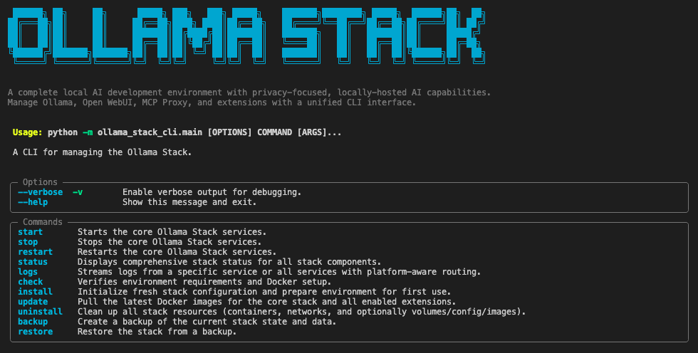

# Ollama Stack

A local AI development environment with Ollama, Open WebUI, and extensible tool integration.

## Prerequisites

- [Docker](https://www.docker.com/products/docker-desktop/) running
- For Apple Silicon: [Ollama](https://ollama.ai/) installed 
- [Optional] For NVIDIA: GPU drivers and [NVIDIA Container Toolkit](https://docs.nvidia.com/datacenter/cloud-native/container-toolkit/install-guide.html)

## Installation

```bash
# Clone and install
git clone https://github.com/tellerj/ollama-stack.git
cd ollama-stack

# Install CLI tool
./install-ollama-stack.sh             # macOS/Linux
.\install-ollama-stack.ps1            # Windows

# If Windows blocks execution: 
powershell -ExecutionPolicy Bypass -File install-ollama-stack.ps1
```

## Quick Start

```bash
# Initialize configuration (first time only)
ollama-stack install

# Start the stack
ollama-stack start

# Check status  
ollama-stack status

# Stop when done
ollama-stack stop
```

Access the web interface at `http://localhost:8080`

## Commands



### Setup and Configuration

```bash
# Create fresh configuration with secure keys
ollama-stack install

# Validate environment and configuration
ollama-stack check

# Force reinstall without prompts
ollama-stack install --force
```

### Stack Management

```bash
# Start all services
ollama-stack start

# Stop all services
ollama-stack stop

# Restart all services
ollama-stack restart

# Check service status
ollama-stack status

# View service logs
ollama-stack logs [service_name]
```

### Updates and Maintenance

```bash
# Update all stack components
ollama-stack update

# Update only core services
ollama-stack update --services

# Update only extensions
ollama-stack update --extensions

# Update with progress details
ollama-stack update --verbose
```

### Backup and Restore

```bash
# Create backup with volumes and configuration
ollama-stack backup

# Restore from backup
ollama-stack restore ./backup-20240101-120000

# Validate backup without restoring
ollama-stack restore ./backup-20240101-120000 --validate-only
```

### Cleanup and Removal

```bash
# Remove stack containers and networks
ollama-stack uninstall

# Remove everything including volumes (data loss!)
ollama-stack uninstall --remove-volumes

# Remove configuration files
ollama-stack uninstall --remove-config

# Complete removal (containers, volumes, config)
ollama-stack uninstall --all
```

## What You Get

### Core Services

- **Ollama** (port 11434): Local AI model server
- **Open WebUI** (port 8080): Chat interface with model management
- **MCP Proxy** (port 8200): REST API for AI tool integration

### Platform Optimization

The stack automatically detects and optimizes for your hardware:
- **Apple Silicon**: Uses native Ollama with Docker services
- **NVIDIA GPU**: Enables CUDA acceleration  
- **CPU**: Standard Docker configuration

### Model Management

Download and run models directly in Open WebUI:
```
# In the web interface chat
/pull llama3.2
/pull codellama
```

Models are shared between Ollama and Open WebUI automatically.

### Tool Integration

The MCP Proxy exposes AI tools via REST API at `http://localhost:8200`. Tools can be integrated into workflows or called directly:

```bash
# Example: List available tools
curl http://localhost:8200/tools

# Example: Use a tool
curl -X POST http://localhost:8200/tools/web_search \
  -H "Content-Type: application/json" \
  -d '{"query": "latest AI news"}'
```

### Extensions

Extensions add specialized capabilities through the Model Context Protocol (MCP). Extension management commands are planned for future releases.

## Troubleshooting

**Stack won't start**: Run `ollama-stack check` to validate your environment

**Services not responding**: Check logs with `ollama-stack logs`

**Apple Silicon**: Ensure Ollama app is running before starting the stack

**NVIDIA**: Verify `nvidia-smi` works and Container Toolkit is installed

