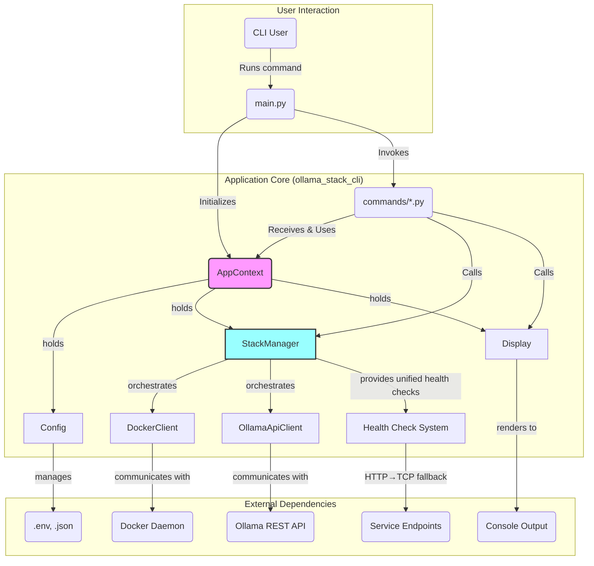

# 02: Project Architecture

This document defines the file and directory structure for the Python-based CLI tool and its current implementation status.

## 1. Top-Level Directory Structure

The root of the project contains the CLI source code, stack configurations, and project metadata.

```
ollama-stack/
├── ollama_stack_cli/
├── docker-compose.yml
├── docker-compose.apple.yml
├── docker-compose.nvidia.yml
├── extensions/
│   ├── registry.json
│   ├── manage.sh
│   └── dia-tts-mcp/
├── install-ollama-stack.sh
├── install-ollama-stack.ps1
├── pyproject.toml
├── .ollama-stack.json
├── README.md
├── CHANGELOG.md
├── CONTRIBUTING.md
└── project-plan/
```

### 1.1. Component Responsibilities

- **`ollama_stack_cli/`**: The Python source package for the command-line tool.
- **`docker-compose.*.yml`**: Docker Compose files defining the stack's services. These are static assets not modified by the CLI.
- **`extensions/`**: Directory containing all available extensions and the extension registry.
  - **`registry.json`**: Central catalog of available MCP extensions
  - **`manage.sh`**: Extension management utility script
  - **Individual extension directories**: Self-contained extension implementations
- **`install-ollama-stack.sh` / `install-ollama-stack.ps1`**: Cross-platform installer scripts that verify the Python environment and run `pip install -e .`.
- **`pyproject.toml`**: Python project definition file specifying build requirements, dependencies, and the `ollama-stack` console script entry point.
- **`.ollama-stack.json`**: Machine-readable file storing CLI internal state (enabled extensions, configuration).
- **`README.md`**: Project documentation with installation and usage instructions.
- **`CHANGELOG.md`**: Version history and user-facing changes (currently at v0.2.0).
- **`CONTRIBUTING.md`**: Developer guidelines and contribution workflow.

## 2. Python Package Architecture (`ollama_stack_cli/`)

The application follows a centralized architecture with `StackManager` orchestrating operations and `AppContext` providing dependency injection.



### 2.1. Current Source Code Structure

```
ollama_stack_cli/
│
├── __init__.py
├── main.py
├── context.py
├── config.py
├── display.py
├── stack_manager.py
├── docker_client.py
├── ollama_api_client.py
├── schemas.py
├── options.py
│
└── commands/
    ├── __init__.py
    ├── start.py           ✅ Implemented
    ├── stop.py            ✅ Implemented  
    ├── restart.py         ✅ Implemented
    ├── status.py          ✅ Implemented
    ├── logs.py            ✅ Implemented
    ├── check.py           ✅ Implemented
    ├── update.py          🔄 Planned (Phase 5)
    ├── uninstall.py       🔄 Planned (Phase 5)
    ├── backup.py          🔄 Planned (Phase 6)
    ├── restore.py         🔄 Planned (Phase 6)
    
    └── extensions.py      🔄 Planned (Phase 7)
```

### 2.2. Module Responsibilities

#### Core Infrastructure (✅ Complete)

- **`main.py`**: Application entry point responsible for:
    - Initializing a single `AppContext` instance
    - Using `typer` to construct the CLI and register commands
    - Handling global options (`--verbose`) and passing the `AppContext` to all command functions

- **`context.py`**: Defines the `AppContext` class - the central dependency injection container:
    - Loads and holds the configuration object from `config.py`
    - Initializes and holds the `StackManager` instance  
    - Initializes and holds the `Display` handler instance
    - Provides consistent access to core services across all commands

- **`display.py`**: Single source of truth for all user-facing output and logging:
    - Initializes the root logger and configures `RichHandler` for consistent styling
    - Provides methods for user-facing results (`success()`, `error()`, `table()`, `spinner()`)
    - Only module that directly imports and configures `rich`
    - Ensures 100% consistent look and feel across all output

- **`config.py`**: Interface for all persistent configuration and state management:
    - Reads base configuration from `.env` and `.ollama-stack.json`
    - Applies platform-specific overrides to service configurations
    - Manages the service registry and extension state
    - Handles default values and configuration validation using Pydantic

- **`stack_manager.py`**: Central orchestrator and primary backend for all CLI commands:
    - **Service Orchestration**: Iterates over service registry and delegates to appropriate clients
    - **Unified Health Checking**: Provides consistent health monitoring across all service types using HTTP → TCP fallback
    - **Platform-Agnostic Logic**: Contains no platform-specific code, making it highly extensible
    - **Extension Management**: Will coordinate extension lifecycle operations
    - **State Coordination**: Manages complex multi-service operations

- **`docker_client.py`**: Low-level Docker Engine abstraction layer:
    - Only module that imports and uses the `docker` Python SDK
    - Provides container, volume, and network management functions
    - **No Health Checking**: Returns `health="unknown"` for containers, delegating health checks to `StackManager`
    - Platform-unaware - executes Docker tasks as instructed
    - Graceful error handling for Docker daemon unavailability

- **`ollama_api_client.py`**: Native Ollama HTTP API client:
    - Makes HTTP requests to Ollama server (e.g., `GET /api/ps`)
    - Parses JSON responses from Ollama API
    - **Rich Native Status**: Provides detailed service information (model counts, installation status) beyond basic connectivity
    - Different purpose than unified health checks - detailed status vs basic reachability

- **`schemas.py`**: Data structure definitions using Pydantic models:
    - Defines all major data structures (`ServiceConfig`, `ExtensionConfig`, `AppConfig`)
    - Service registry implementation mapping service names to configurations
    - Configuration validation and type safety
    - Foundation for the application's extensible architecture

- **`options.py`**: Shared command-line option definitions and utilities for consistent CLI behavior

#### Command Modules

**✅ Implemented Commands (Phase 1-3):**
- **`start.py`**: Core stack startup with platform detection and health verification
- **`stop.py`**: Graceful shutdown preserving data volumes  
- **`restart.py`**: Full restart with option passthrough
- **`status.py`**: Comprehensive status overview with unified health checking
- **`logs.py`**: Service log viewing with real-time capabilities
- **`check.py`**: Environment validation and diagnostics

**🔄 Planned Commands (Phase 5-7):**
- **`update.py`**: Image updates for stack and extensions
- **`uninstall.py`**: Safe resource removal with confirmation prompts
- **`backup.py`**: Full backup creation with volume support
- **`restore.py`**: Backup restoration with validation

- **`extensions.py`**: Complete extension lifecycle management

### 2.3. Unified Health Check Architecture (✅ Implemented)

The application implements a centralized health checking system to ensure consistent status reporting:

1. **StackManager Coordination**
   - Provides `check_service_health()` method with HTTP → TCP fallback
   - Applies unified health checks to all running services
   - Single source of truth for service health status

2. **Service-Specific Responsibilities**  
   - `DockerClient`: Container management only, no health checking
   - `OllamaApiClient`: Rich native service status for detailed information
   - `StackManager`: Unified health checking for consistent user experience

3. **Health Check Flow**
   - `get_docker_services_status()` gets containers from Docker
   - For running services, applies unified health checks
   - Returns consistent health status across all service types

### 2.4. Future Architecture Enhancements

**Phase 5 (Resource Management) Additions:**
- `stack_manager.py`: Add resource discovery, update orchestration, and cleanup workflows
- `docker_client.py`: Add image pulling with progress, resource removal with safety checks

**Phase 6 (Backup/Migration) Additions:**
- `stack_manager.py`: Add backup creation, restoration workflows, and migration orchestration
- `docker_client.py`: Add volume backup/restore capabilities
- `config.py`: Add configuration export/import with validation

**Phase 7 (Extension Management) Additions:**
- `stack_manager.py`: Add extension lifecycle management and dependency validation
- `config.py`: Add extension state management and configuration validation

## 3. Testing Architecture

**Current Status:** 296 unit tests + 11 integration tests (100% pass rate)

### 3.1. Current Testing Coverage ✅
- **Unit Tests**: Comprehensive coverage of all core modules with mocked dependencies
- **Integration Tests**: End-to-end validation against live Docker daemon
- **Test Organization**: Parallel structure to source code in `tests/` directory

### 3.2. Future Testing Requirements 🔄
- **Phase 5**: Resource management testing with Docker operations
- **Phase 6**: Backup/restore workflow validation and migration testing
- **Phase 7**: Extension lifecycle and dependency resolution testing

## 4. Versioning and Distribution

- **Current Version**: v0.2.0 (Mid-Implementation)
- **Changelog**: `CHANGELOG.md` documents all user-facing changes
- **Distribution**: Ready for Python Package Index (PyPI) distribution
- **Installation**: Cross-platform scripts for streamlined setup

### 4.1. Release Roadmap
- **v0.3.0**: Resource Management (update, uninstall commands)
- **v0.5.0**: Backup and Restore (backup, restore commands)  
- **v0.6.0**: Extension Management (full extensions command group)
- **v1.0.0**: Production Release with PyPI distribution
