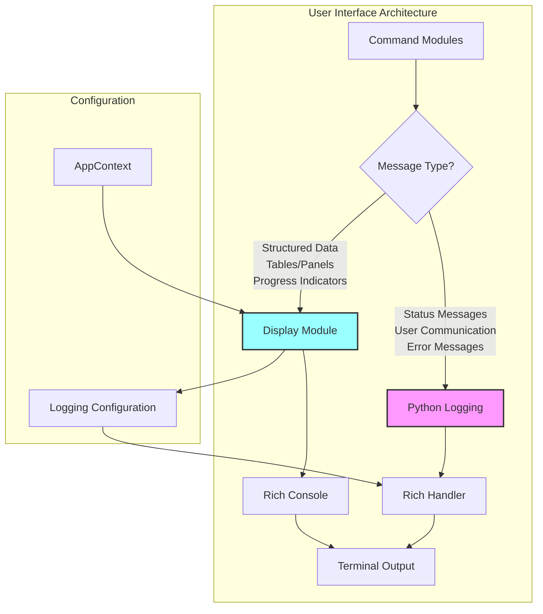

# 07: Logging and Display Architecture

This document explains the logging and UI display architecture used throughout the `ollama-stack` CLI project, including the separation of concerns, implementation patterns, and best practices.

---

## 1. Architecture Overview

The project uses a **dual-channel approach** for user communication, with clear separation between structured UI elements and message-based communication:

- **Display Module (`display.py`)**: Handles structured UI elements (tables, panels, progress bars) and configures logging
- **Python Logging System**: Handles all user messages, status updates, and operational communication

This separation ensures consistent styling, maintainable code, and clear responsibility boundaries.



---

## 2. Display Module Architecture

### 2.1. Core Responsibilities

The `Display` class in `display.py` has **three primary responsibilities**:

1. **Logging System Configuration**: Sets up Python's logging with Rich integration
2. **Structured UI Elements**: Provides methods for tables, panels, and progress indicators  
3. **Terminal Abstraction**: Centralizes all Rich console interactions

### 2.2. Implementation Pattern

```python
class Display:
    def __init__(self, verbose: bool = False):
        self._console = Console()
        self._verbose = verbose
        
        # Configure logging with Rich integration
        logging.basicConfig(
            level="DEBUG" if verbose else "INFO",
            format="%(message)s",
            datefmt="[%X]",
            handlers=[RichHandler(console=self._console, rich_tracebacks=True)]
        )
```

**Key Design Principles:**
- **Single Console Instance**: All Rich output goes through one console for consistency
- **Centralized Configuration**: Logging is configured once during Display initialization
- **Verbose Mode Support**: Controls both logging level and Rich output detail

### 2.3. Display Module Methods

#### Structured UI Elements
```python
# Tables with consistent styling
ctx.display.table(title="Stack Status", columns=["Service", "Status"], rows=data)

# Information panels with border styling  
ctx.display.panel(content="Configuration loaded", title="Info", border_style="blue")

# Error panels with suggestions
ctx.display.error("Operation failed", suggestion="Try running 'docker ps' to check state")

# Progress bars for long operations
with ctx.display.progress() as progress:
    task = progress.add_task("Pulling images...", total=100)
```

#### Special Cases
```python
# Raw log streaming (for Docker container logs)
ctx.display.log_message(container_log_line)

# JSON output (machine-readable)
ctx.display.json(json.dumps(status_data))

# Direct console access (when needed)
ctx.display.print("[bold]Important message[/bold]")
```

---

## 3. Logging System Architecture

### 3.1. Standard Python Logging

All user communication uses Python's standard logging module with Rich formatting:

```python
import logging

log = logging.getLogger(__name__)

# Status updates and user information
log.info("Starting Docker services...")
log.info("Stack stopped successfully")

# Warnings for recoverable issues  
log.warning("Configuration file not found, using defaults")

# Errors for failed operations
log.error("Failed to connect to Docker daemon")

# Debug information (verbose mode only)
log.debug("Using compose files: docker-compose.yml, docker-compose.apple.yml")
```

### 3.2. Logging Levels and Usage

| Level | Usage | Example |
|-------|-------|---------|
| `DEBUG` | Internal state, detailed flow info (verbose mode only) | `log.debug("Platform detected: apple")` |
| `INFO` | User-facing status, successful operations | `log.info("Core services started successfully")` |
| `WARNING` | Recoverable issues, fallback behaviors | `log.warning("Extension update not yet implemented")` |
| `ERROR` | Failed operations, configuration errors | `log.error("Docker daemon is not running")` |

### 3.3. Rich Integration

Logging automatically benefits from Rich formatting through the configured `RichHandler`:

- **Timestamps**: Automatically added with `[%X]` format
- **Color Coding**: Error messages in red, warnings in yellow, info in default color
- **Console Styling**: Consistent with other Rich output
- **Verbose Mode**: Shows module names and additional detail when enabled

---

## 4. Usage Patterns by Module Type

### 4.1. Command Modules (`commands/*.py`)

Commands follow a **strict separation pattern**:

```python
import logging
from ..context import AppContext

log = logging.getLogger(__name__)

def start_services_logic(app_context: AppContext, update: bool = False):
    """Business logic using logging for communication."""
    
    # ✅ CORRECT: Use logging for user communication
    log.info("Starting Docker services...")
    log.info("All services started successfully")
    
    # ✅ CORRECT: Use display for structured UI
    app_context.display.table("Service Status", columns, rows)
    
    # ❌ INCORRECT: Never mix paradigms
    # app_context.display.success("Services started")  # Use log.info() instead
    # print("Starting services...")  # Use log.info() instead
```

### 4.2. Core Service Modules (`stack_manager.py`, `docker_client.py`, etc.)

Core modules use **logging exclusively** for any user-visible communication:

```python
import logging

log = logging.getLogger(__name__)

class StackManager:
    def start_docker_services(self, services: List[str]):
        """Service implementation using logging."""
        
        # ✅ CORRECT: Internal communication through logging
        log.debug(f"Starting services: {services}")
        log.info("Docker services started successfully")
        
        # ❌ INCORRECT: Core modules never use display directly
        # self.display.success(...)  # Commands handle UI, not core services
```

### 4.3. User Interaction Points

**Logging** handles the vast majority of user communication:
- Status updates during operations
- Success and error messages  
- Informational messages and warnings
- Debug output in verbose mode

**Display** handles specialized UI needs:
- Data presentation (status tables)
- Progress indication for long operations
- Error panels with suggestions
- JSON output for automation

---

## 5. Error Handling Architecture

### 5.1. Error Communication Pattern

```python
# Standard error pattern
try:
    result = risky_operation()
    log.info("Operation completed successfully")
except SpecificException as e:
    log.error(f"Operation failed: {str(e)}")
    return False

# Error with suggestion panel (for critical errors)
try:
    docker_client.connect()
except ConnectionError:
    ctx.display.error(
        "Cannot connect to Docker daemon",
        suggestion="Ensure Docker Desktop is running and try again"
    )
    raise typer.Exit(1)
```

### 5.2. Error Escalation Levels

1. **Logging Errors**: Most operational failures (network issues, command failures)
2. **Display Error Panels**: Critical system errors requiring user action (Docker unavailable, configuration corruption)
3. **Typer Exit**: Terminal errors that end command execution

---

## 6. Configuration and Initialization

### 6.1. AppContext Pattern

The `AppContext` initializes the display system and makes it available to all commands:

```python
# context.py
class AppContext:
    def __init__(self, verbose: bool = False):
        self.display = Display(verbose=verbose)  # Configures logging
        self.config = Config(self.display)       # May need display for errors
        self.stack_manager = StackManager(...)   # Uses logging only
```

### 6.2. Command Integration

Commands receive the configured context and use both systems appropriately:

```python
# commands/start.py
def start(ctx: typer.Context, update: bool = False):
    """Command function with proper context usage."""
    app_context: AppContext = ctx.obj
    
    # Use logging for operational communication
    log.info("Starting stack services...")
    
    # Use display for structured results
    if success:
        app_context.display.table("Service Status", columns, status_data)
```

---

## 7. Best Practices and Guidelines

### 7.1. When to Use Logging vs Display

**Use Logging For:**
- ✅ Status updates during operations
- ✅ Success and error messages
- ✅ User information and warnings  
- ✅ Debug output and diagnostics
- ✅ Any sequential, message-based communication

**Use Display For:**
- ✅ Tables and structured data presentation
- ✅ Progress bars and spinners for long operations
- ✅ Information panels with borders and styling
- ✅ Error panels with suggestions for critical issues
- ✅ JSON output for machine consumption

### 7.2. Module-Level Guidelines

**Command Modules (`commands/*.py`):**
- Import logging and create module logger: `log = logging.getLogger(__name__)`
- Use `log.*()` for all user communication
- Use `ctx.display.*()` only for structured UI elements
- Never import Rich directly or use `print()` statements

**Core Service Modules (`*.py`):**
- Use logging exclusively for any user-visible output
- Never access display module directly
- Focus on business logic, let commands handle UI
- Return data structures that commands can present

**Display Module (`display.py`):**
- Only module that imports Rich directly
- Configures logging system with Rich integration
- Provides structured UI methods for commands
- Abstracts all terminal/console operations

### 7.3. Logging Configuration

**Standard Logger Creation:**
```python
import logging
log = logging.getLogger(__name__)  # Module-specific logger
```

**Preferred Logging Patterns:**
```python
# ✅ GOOD: Clear, actionable messages
log.info("Core services started successfully")
log.error("Failed to pull Docker images")
log.warning("Configuration file not found, using defaults")

# ❌ AVOID: Technical details in user messages
log.info("Container 'webui' state: running=True, health=healthy")
log.error("docker.errors.APIError: 500 Server Error")
```

### 7.4. Verbose Mode Handling

The `--verbose` flag affects both logging and display output:

```python
# Verbose-aware logging
log.debug("Detailed information for troubleshooting")  # Only shown with --verbose
log.info("Always shown to users")

# Verbose-aware display configuration
Display(verbose=True)  # Shows path and level information in logs
```

---

## 8. Migration from Other Patterns

### 8.1. Common Anti-Patterns to Avoid

```python
# ❌ WRONG: Direct Rich usage in commands
from rich.console import Console
console = Console()
console.print("Message")

# ✅ CORRECT: Use logging
log.info("Message")

# ❌ WRONG: Direct print statements
print("Operation completed")

# ✅ CORRECT: Use logging
log.info("Operation completed")

# ❌ WRONG: Display for simple messages
ctx.display.success("File saved")

# ✅ CORRECT: Use logging
log.info("File saved successfully")
```

### 8.2. Legacy Code Migration

When updating existing code:

1. **Replace `print()` statements** with appropriate `log.*()` calls
2. **Replace direct Rich usage** with logging or display methods
3. **Consolidate UI logic** to use display methods for structured elements
4. **Remove duplicate logging configuration** (Display handles this)

---

## 9. Testing Implications

### 9.1. Unit Testing

```python
def test_command_logging(caplog):
    """Test logging output in commands."""
    with caplog.at_level(logging.INFO):
        command_function()
        assert "Expected message" in caplog.text

def test_display_output(mock_display):
    """Test display method calls."""
    command_function(app_context_with_mock_display)
    mock_display.table.assert_called_once()
```

### 9.2. Integration Testing

Integration tests capture both logging and display output:

```python
from typer.testing import CliRunner

def test_full_command_output():
    """Test complete command output."""
    result = runner.invoke(app, ["status"])
    assert "Stack Status" in result.stdout  # Display table output
    assert "INFO" in result.stdout          # Logging output
```

---

## 10. Future Considerations

### 10.1. Extensibility

The current architecture supports future enhancements:

- **Custom Formatters**: Can add specialized output formats
- **Additional UI Elements**: New display methods for complex data
- **Logging Backends**: Support for file logging, remote logging
- **Internationalization**: Centralized text management for multiple languages

### 10.2. Performance

The architecture optimizes for performance:

- **Lazy Evaluation**: Rich formatting only applied when output is displayed
- **Single Console**: No overhead from multiple console instances
- **Efficient Logging**: Standard Python logging with Rich integration

This architecture provides a solid foundation for consistent, maintainable user interface code throughout the ollama-stack CLI project. 