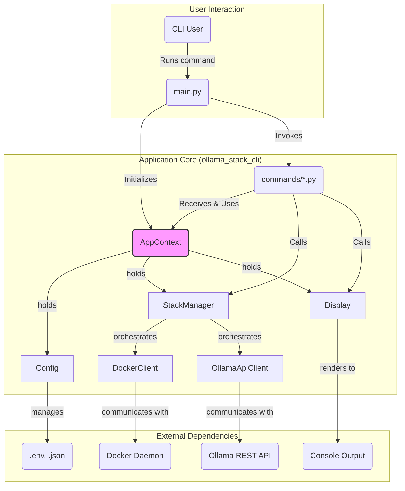

# 01: Project Architecture

This document defines the file and directory structure for the new Python-based CLI tool.

## 1. Top-Level Directory Structure

The root of the project will contain the CLI source code, stack configurations, and project metadata.

```
ollama-stack/
├── ollama_stack_cli/
├── docker-compose.yml
├── docker-compose.apple.yml
├── docker-compose.nvidia.yml
├── extensions/
├── install.sh
├── install.ps1
├── pyproject.toml
├── .ollama-stack.json
└── README.md
```

### 1.1. Component Responsibilities

- **`ollama_stack_cli/`**: The Python source package for the command-line tool.
- **`docker-compose.*.yml`**: The Docker Compose files that define the stack's services. These are considered static assets and are not modified by the CLI.
- **`extensions/`**: Directory containing all available extensions. The CLI reads from this directory but does not modify its contents.
- **`install.sh` / `install.ps1`**: Simplified installer scripts. Their sole responsibility is to verify the Python environment and run `pip install .`.
- **`pyproject.toml`**: The unified Python project definition file. It specifies build system requirements, project dependencies, and defines the `ollama-stack` console script entry point.
- **`.ollama-stack.json`**: A machine-readable file for storing the CLI's internal state, such as the list of enabled extensions.
- **`README.md`**: Project documentation, to be updated to reflect the new CLI tool and installation process.

## 2. Python Package Architecture (`ollama_stack_cli/`)

Below is a high-level diagram illustrating the flow of control and dependency management within the `ollama-stack` CLI. The central `AppContext` is passed to each command, providing a consistent and decoupled way to access core services like the `StackManager` and `Display` handler.



The source code is organized into modules with clear, single responsibilities.

```
ollama_stack_cli/
│
├── __init__.py
├── main.py
├── context.py
├── config.py
├── display.py
├── stack_manager.py
├── docker_client.py
├── ollama_api_client.py
├── schemas.py
│
└── commands/
    ├── __init__.py
    ├── start.py
    ├── stop.py
    ├── status.py
    └── extensions.py
```

### 2.1. Module Responsibilities

- **`main.py`**: The main entry point of the application. It is responsible for:
    - Initializing a single `AppContext` instance.
    - Using `typer` to construct the CLI and register commands.
    - Handling global options and passing the `AppContext` to all command functions.

- **`context.py`**: Defines the `AppContext` class. This class acts as a central container for the application's runtime state. It is responsible for:
    - Loading and holding the configuration object from `config.py`.
    - Initializing and holding the `StackManager` instance.
    - Initializing and holding the `Display` handler instance.

- **`display.py`**: The single source of truth for all user-facing output and logging configuration. This module is responsible for initializing the root logger and configuring a `RichHandler` to ensure all output—both direct and logged—is consistently styled. It provides methods for user-facing results (e.g., `display.success()`, `display.table()`) and is the only module that should directly import and configure `rich`.

- **`config.py`**: The interface for all persistent configuration and state. It reads the base configuration from files and is responsible for applying any platform-specific overrides to the service registry (e.g., re-configuring the `ollama` service to be of type `native-api` on Apple Silicon).

- **`stack_manager.py`**: A config-driven orchestrator that acts as the primary backend for all CLI commands. It iterates over the service registry from the `AppConfig` and delegates tasks to the appropriate client based on each service's configured `type` (e.g., 'docker', 'native-api'). It contains no platform-specific logic itself, making it highly extensible.

- **`docker_client.py`**: A low-level abstraction layer over the Docker Engine.
    - It is the only module that imports and uses the `docker` Python SDK.
    - Provides functions for managing Docker resources (containers, volumes, networks) when instructed by the `StackManager`.
    - It is "platform-unaware" and simply executes the Docker tasks it is given.

- **`ollama_api_client.py`**: A low-level client for the native Ollama HTTP API.
    - Responsible for making HTTP requests to the Ollama server (e.g., `GET /api/ps`).
    - Handles parsing the JSON responses from the Ollama API.

- **`schemas.py`**: Defines the data structures used throughout the application. It contains Pydantic models for all major data structures, including `ServiceConfig` which defines a service's `type`. The main `AppConfig` model uses these to create a **Service Registry**—a dictionary that maps service names to their configurations. This registry-based approach is the key to the application's extensibility.

- **`commands/`**: A Python sub-package containing the implementation for each CLI command.
    - Each file (e.g., `start.py`, `status.py`) contains a `typer` command function.
    - Command functions receive the `AppContext` object.
    - They are responsible for orchestrating calls to the services held in the context (`ctx.stack_manager`, `ctx.config`) and using the display handler (`ctx.display`) to report results. They contain minimal business logic themselves.

### 2.2. Internal Safety Mechanisms

The CLI tool implements several internal mechanisms to ensure safe operation and prevent conflicts:

1. **Operation State Management**
   - The `docker_client.py` module tracks operation state internally
   - Operations are atomic and can be rolled back if interrupted
   - State changes are verified before and after operations

2. **Concurrency Control**
   - The `docker_client.py` module implements internal locking
   - Prevents concurrent operations on the same resources
   - Automatically handles lock timeouts and cleanup

3. **Recovery Procedures**
   - Built-in recovery for common failure scenarios
   - Automatic rollback of partial operations
   - State verification and repair if needed

## 3. Versioning and Distribution
- **Principle**: The project must have a clear versioning scheme and a standard distribution channel to provide a stable and predictable experience for users.
- **Implementation**:
    - **Versioning**: The project will follow **Semantic Versioning (SemVer)** (e.g., `v1.2.3`).
    - **Changelog**: A `CHANGELOG.md` file will be maintained to document all user-facing changes in each release.
    - **Distribution**: The `ollama-stack` CLI tool will be packaged and distributed via the Python Package Index (PyPI).
